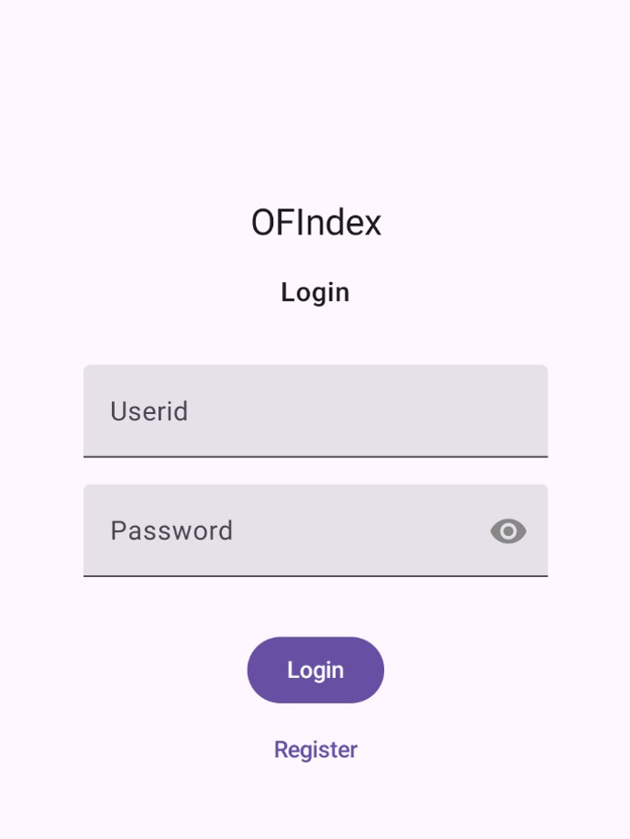
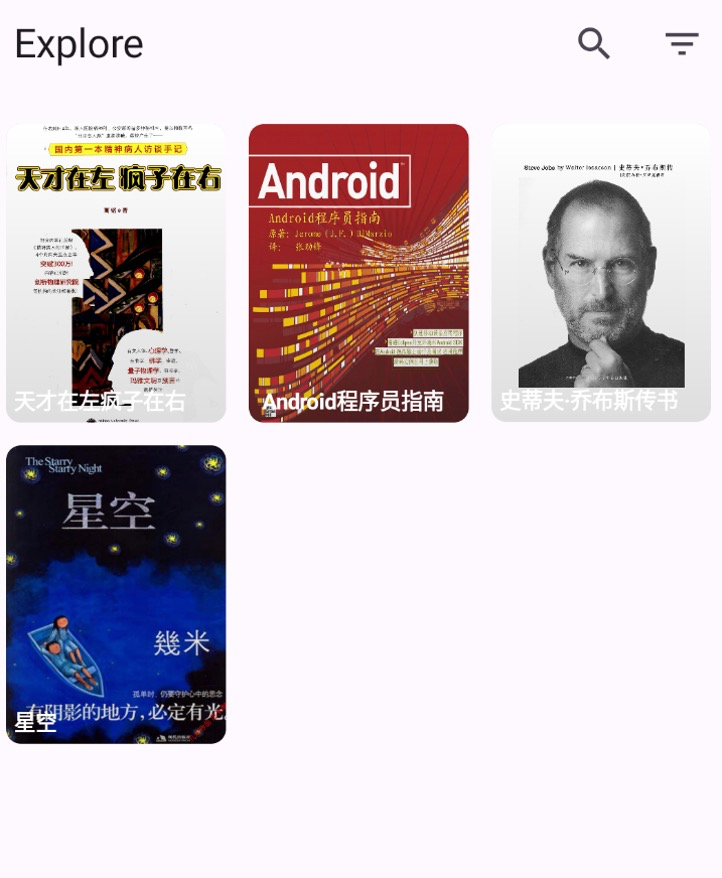
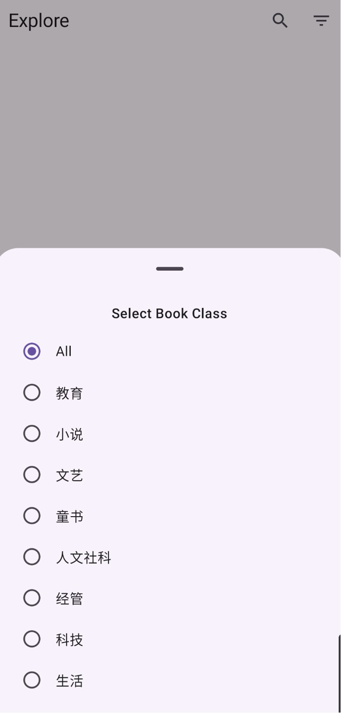
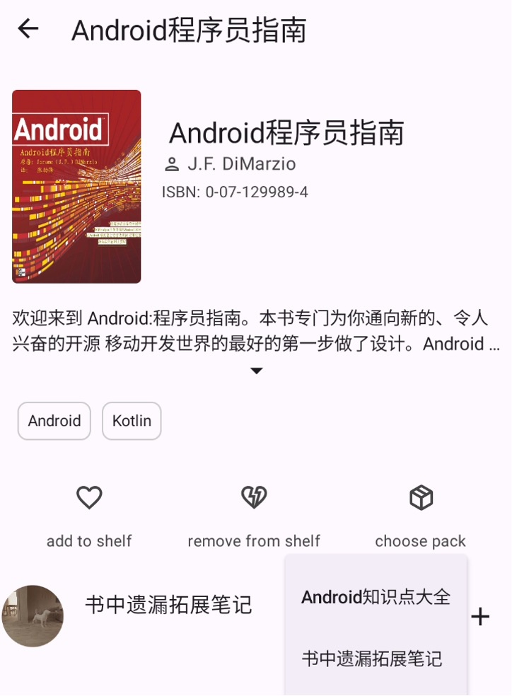
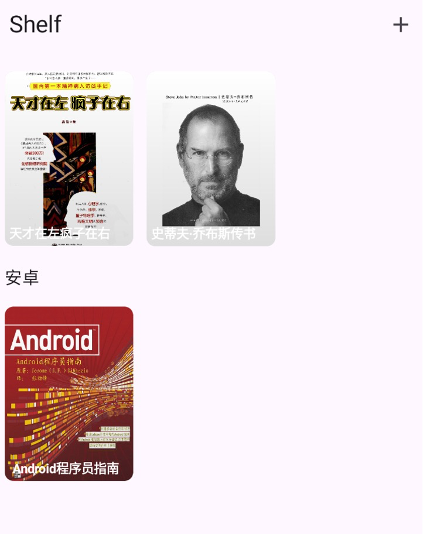
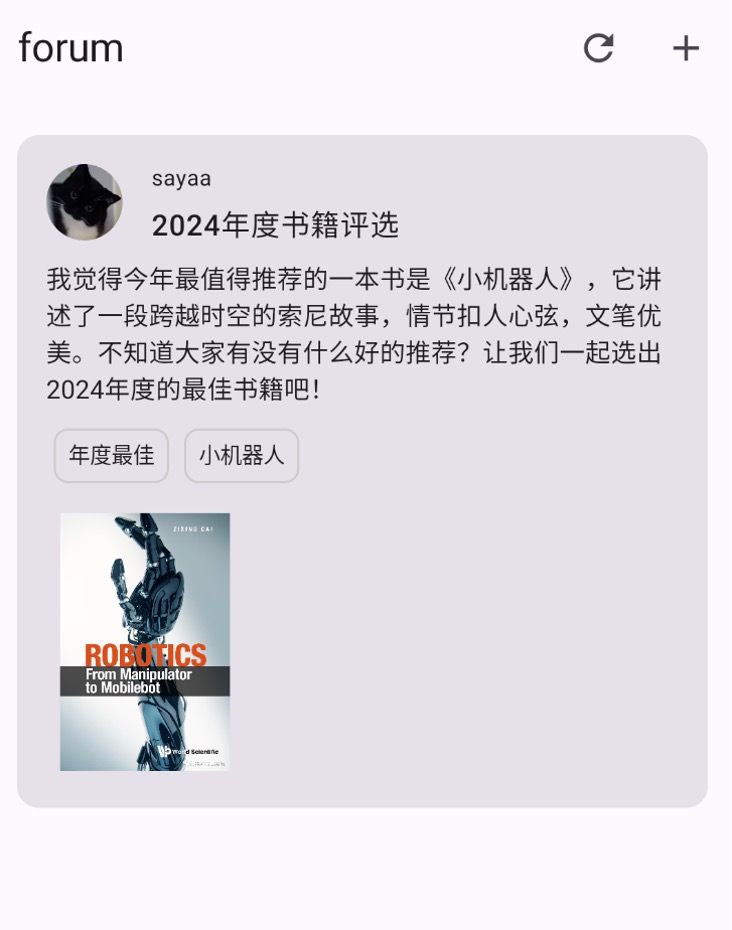
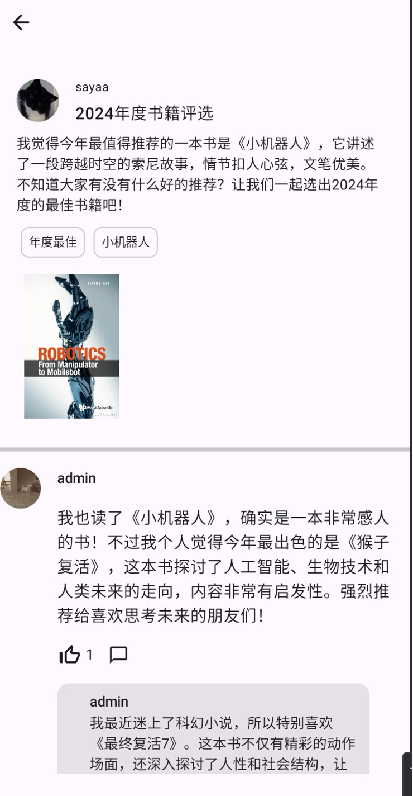
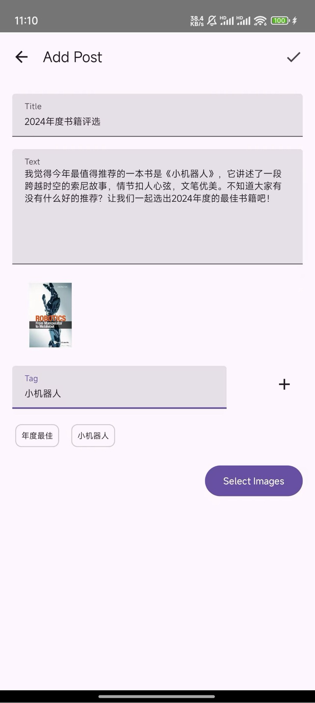
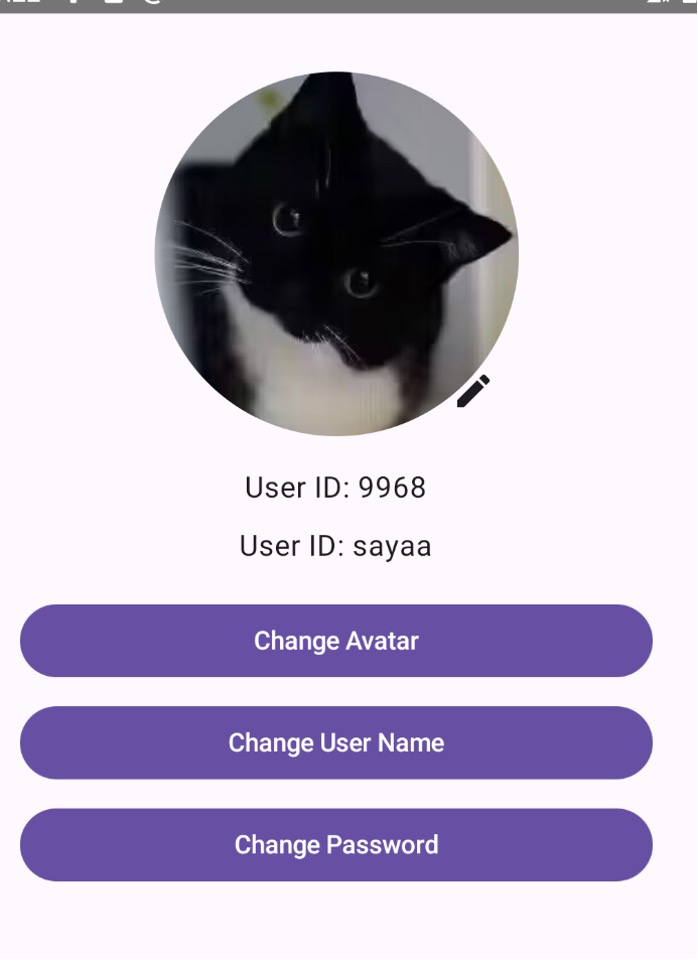

# 功能概述

## 登录/注册

第一次进入软件后，会显示登录/注册页，在用户输入ID和密码后，与后台校验，进入主页。

## 探索页

浏览服务器上的书目，并可以进行搜索和按照分类筛选。

在用户选择书目后，会进入书籍详情页，详情页显示书的各个信息，如简介，tag，作者等。详情部分底部是三个按钮，分别用于添加书架，移出书架，和选择阅读资源包。

在详情页的下方会显示书籍可用的资源包列表，列表项可以进行点赞和添加资源包操作，在用户将资源包添加到账户后，可以在阅读时选择资源包，实现在阅读时查看其他人留下的批注和笔记，阅读思维导图，帮助读者理解书中内容。

## 书架页

未分类图书在最上方显示，下面按列表显示书单中的图书。点击图书后，进入书籍详情页，和探索页中详情页相同。

## 论坛页

点击后可以进入帖子详情，包含帖子详细内容和回复。屏幕底部有输入框可以对帖子进行回复。如果想要对回复进行回复，可以点击回复边上的评论键，对特定帖子进行回复。

## 个人页

